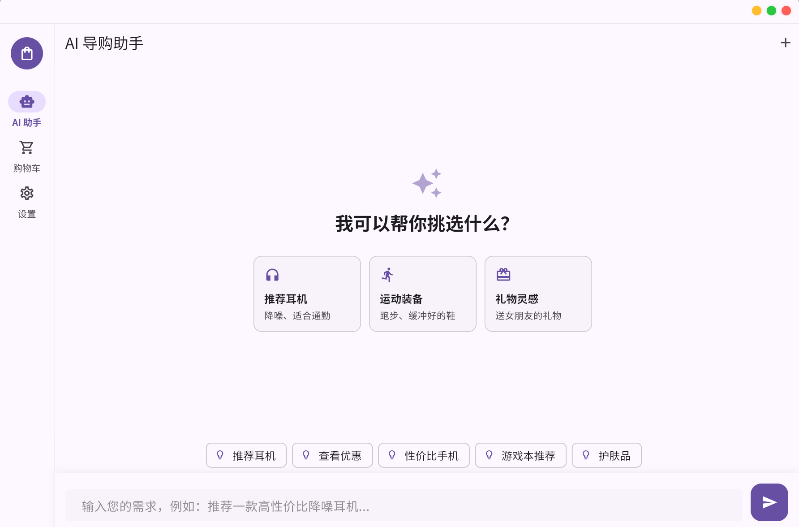

# 快淘帮 WisePick

<div align="center">


<br><br>

<br><br>


**基于 AI 的智能购物推荐应用**

通过自然语言对话帮助用户在多平台（淘宝、京东、拼多多）中快速找到心仪商品

[功能特性](#-核心功能) • [快速开始](#-快速开始) • [技术架构](#-技术架构) • [配置说明](#-配置说明)

</div>

---

## 📖 项目简介

快淘帮 WisePick 是一款基于 AI 的智能购物推荐应用，通过自然语言对话帮助用户在多平台（淘宝、京东、拼多多）中快速找到心仪商品，并提供推广链接生成、购物车管理等一站式购物辅助服务。

### 核心价值

- 🤖 **智能推荐**: 基于 AI 理解用户需求，提供个性化商品推荐
- 🔍 **多平台聚合**: 统一搜索淘宝、京东、拼多多三大电商平台
- 🔗 **推广链接**: 自动生成联盟推广链接，支持佣金收益
- 🛒 **选品管理**: 提供购物车功能，方便用户收藏和比价
- 💰 **价格监控**: 自动刷新商品价格，降价时及时通知
- 📊 **价格历史**: 记录商品价格变化历史，提供趋势分析和购买时机建议
- ⚖️ **商品比价**: 多商品对比功能，智能评分系统，帮助做出最佳购买决策
- 👤 **用户账号**: 支持邮箱注册登录，多设备管理
- ☁️ **云端同步**: 购物车和会话记录自动云端同步，多端无缝切换
- 🎛️ **独立管理后台**: 独立的管理员后台应用，提供用户管理、数据统计、系统监控等功能

---

## ✨ 核心功能

### 1. AI 助手聊天
- 自然语言对话，理解用户购物需求
- 流式响应，实时显示 AI 回复
- 智能识别用户意图（推荐请求 vs 普通问答）
- 支持结构化 JSON 推荐和自然语言回复
- 会话历史管理，支持多会话切换

### 2. 多平台商品搜索
- 支持淘宝、京东、拼多多三大平台
- 并行搜索，统一展示结果
- 搜索结果去重和合并（优先显示京东结果）
- 支持分页加载和平台筛选
- **智能搜索增强**: 自动生成搜索候选词，提升匹配准确度

### 3. 购物车管理
- 商品添加/删除，按店铺分组显示
- 商品数量调整，批量选择/取消选择
- 价格自动刷新（支持官方 API 模式）
- 价格变化通知
- 批量复制推广链接

### 4. 价格历史功能
- **自动记录**: 商品加入购物车时自动记录初始价格，价格刷新时记录变化
- **价格趋势分析**: 提供价格走势图表，显示最高价、最低价、平均价
- **趋势判断**: 自动分析价格趋势（上涨/下跌/稳定），计算价格波动率
- **购买时机建议**: 基于历史价格数据，智能推荐最佳购买时机
- **多商品价格对比**: 支持同时对比多个商品的价格历史
- **时间范围筛选**: 支持查看近一周、近一月、近三月、近一年的价格历史

### 5. 商品比价功能
- **多商品对比**: 支持同时对比多个商品的详细信息
- **智能评分系统**: 基于价格、评分、销量、平台等多维度综合评分（0-100分）
- **对比维度**: 价格、原价、折扣率、评分、销量、店铺、规格参数等
- **推荐商品**: 自动推荐综合评分最高的商品
- **替代商品推荐**: 基于商品类别和价格区间推荐相似商品
- **可视化对比**: 清晰的对比表格，高亮显示最优和最差项

### 6. 推广链接生成
- 自动生成联盟推广链接（淘宝、京东、拼多多）
- 链接缓存机制（30 分钟有效期）
- 支持复制链接和口令（tpwd）

### 7. 用户账号系统
- 邮箱注册与登录
- JWT Token 认证（Access Token + Refresh Token）
- 多设备登录管理
- 安全的密码加密存储（bcrypt）
- 个人资料编辑（昵称、头像）

### 9. 云端数据同步
- **购物车数据同步**: 多端购物车数据实时同步，支持增量更新
- **会话历史同步**: AI 聊天会话记录云端备份，多设备无缝切换
- **增量同步机制**: 基于版本号的增量同步，减少数据传输量
- **冲突检测与解决**: 自动检测数据冲突，采用"Last Write Wins"策略解决
- **离线支持**: 支持离线使用，变更自动保存到本地队列，联网后自动同步
- **同步状态显示**: 实时显示同步状态（同步中/成功/失败/离线）
- **自动同步**: 数据变更后自动触发同步，支持防抖机制避免频繁请求
- **版本管理**: 每个数据项都有版本号，确保数据一致性

### 10. 管理员功能

#### 9.1. 应用内管理员设置
- LLM API Key 配置
- 后端代理地址配置
- AI 模型选择
- 调试模式和 Mock AI 模式
- 京东联盟参数配置

#### 9.2. 独立管理员后台（wisepick_admin）
独立的 Web 管理后台应用，提供完整的管理功能：

**用户管理**
- 用户列表查看和搜索
- 用户信息编辑（昵称、邮箱、角色等）
- 用户删除和批量操作
- 用户注册时间、最后登录时间统计

**数据统计**
- 用户统计：总用户数、活跃用户数、新增用户趋势
- 购物车统计：总商品数、商品分布、热门商品
- 会话统计：总会话数、消息数、活跃度分析
- 搜索热词统计：热门搜索关键词排行

**系统监控**
- 系统健康状态监控
- API 调用统计
- 错误日志查看
- 性能指标监控

**数据管理**
- 购物车数据查看和管理
- 会话记录查看和删除
- 登录设备管理
- 数据导出功能

**系统设置**
- 系统参数配置
- 安全设置
- 数据备份和恢复

---

## 🚀 快速开始

### 前置条件

- **Flutter SDK**: 3.9.2 或更高版本
- **Dart SDK**: 3.9.2 或更高版本
- **Git**: 用于版本控制
- **IDE**: 推荐使用 VS Code 或 Android Studio（安装 Flutter 插件）

### 安装步骤

1. **克隆仓库**
   ```bash
   git clone <your-repo-url>
   cd wisepick_dart_version
   ```

2. **安装依赖**
   ```bash
   flutter pub get
   ```

3. **运行应用**
   ```bash
   # 桌面端（Windows/macOS/Linux）
   flutter run -d windows
   flutter run -d macos
   flutter run -d linux
   
   # 移动端（Android/iOS）
   flutter run -d android
   flutter run -d ios
   
   # Web
   flutter run -d chrome
   ```

### 构建发布版本

```bash
# 桌面端
flutter build windows
flutter build macos
flutter build linux

# 移动端
flutter build apk --release        # Android APK
flutter build ios --release         # iOS
flutter build web --release         # Web
```

### 启动管理员后台

管理员后台是一个独立的 Web 应用，提供完整的管理功能：

1. **进入管理员后台目录**
   ```bash
   cd wisepick_admin
   ```

2. **安装依赖**
   ```bash
   flutter pub get
   ```

3. **运行管理员后台**
   ```bash
   # Web 模式（推荐）
   flutter run -d chrome
   
   # 或构建 Web 版本
   flutter build web --release
   ```

4. **访问管理员后台**
   - 开发模式：`http://localhost:端口号`
   - 生产模式：部署构建后的 `build/web` 目录到 Web 服务器

**注意**: 管理员后台需要后端服务运行，并配置正确的 API 地址。

---

## 🏗️ 技术架构

### 前端技术栈

- **框架**: Flutter 3.9.2+
- **语言**: Dart 3.9.2+
- **状态管理**: Riverpod 2.5.1
- **本地存储**: Hive 2.2.3
- **网络请求**: Dio 5.1.2
- **UI 组件**: Material Design 3
- **字体**: Noto Sans SC（中文字体支持）

### 后端技术栈

- **语言**: Dart
- **框架**: Shelf
- **数据库**: PostgreSQL（用户账号和同步数据存储）
- **认证**: JWT（Access Token + Refresh Token）
- **功能**: 代理服务器、API 签名、转链、用户认证、数据同步

### 项目结构

```
wisepick_dart_version/
├── lib/                      # Flutter 应用源码
│   ├── core/                 # 核心功能（API 客户端、配置、存储）
│   ├── features/             # 功能模块
│   │   ├── auth/             # 用户认证（登录、注册、Token管理）
│   │   ├── chat/             # AI 聊天
│   │   ├── cart/             # 购物车
│   │   ├── products/         # 商品搜索
│   │   ├── price_history/    # 价格历史（记录、趋势分析、购买建议）
│   │   ├── decision/         # 商品比价（对比、评分、推荐）
│   │   └── admin/            # 管理员功能（应用内设置）
│   ├── services/             # 业务服务
│   │   ├── sync/             # 数据同步（购物车、会话）
│   │   └── price_refresh_service.dart
│   ├── widgets/              # 通用组件
│   └── models/               # 数据模型
├── server/                   # 后端服务
│   ├── bin/
│   │   ├── proxy_server.dart # 服务入口
│   │   ├── .env              # 环境变量（不提交到版本控制）
│   │   └── .env.example      # 环境变量模板
│   ├── lib/
│   │   ├── auth/             # 用户认证（JWT、中间件、Handler）
│   │   ├── sync/             # 数据同步服务
│   │   ├── admin/            # 管理员后台 API
│   │   ├── proxy/            # AI API 代理转发
│   │   ├── database/         # 数据库连接管理
│   │   ├── models/           # 数据模型
│   │   ├── analytics/        # 数据统计
│   │   ├── decision/         # 商品比价服务
│   │   ├── price_history/    # 价格历史服务
│   │   ├── reliability/      # 健康检查
│   │   ├── debug/            # 调试接口
│   │   └── shared/           # 共享状态
│   ├── test/                 # 后端测试
│   │   ├── jwt_service_test.dart
│   │   ├── auth_service_test.dart
│   │   ├── admin_service_test.dart
│   │   ├── proxy_handler_test.dart
│   │   └── helpers/
│   │       └── mock_database.dart
│   └── API.md                # 完整 API 文档
├── wisepick_admin/           # 独立管理员后台（Web）
├── docker-compose.yml        # Docker 一键部署（含 PostgreSQL）
├── test/                     # Flutter 测试
├── assets/                   # 资源文件
└── pubspec.yaml
```

---

## ⚙️ 配置说明

### 前端配置

**用户设置页**（普通用户可配置）：
- **LLM API Key**: 用户自行配置 AI 服务商的 API Key（服务端不持有）
- **LLM Base URL**: AI 服务商的 API 地址（支持 OpenAI 兼容接口）
- **LLM 模型**: 选择要使用的对话模型

**管理员设置页**（需管理员密码）：
- **后端代理地址**: 后端服务器地址（默认: `http://localhost:9527`）
- **Mock AI**: 使用模拟 AI 响应（用于离线开发，默认: 关闭）
- **调试选项**: 显示原始 AI 响应、商品 JSON 等调试开关

### 后端配置

复制 `server/bin/.env.example` 为 `server/bin/.env` 并填入实际值。

#### 必需配置

- `DB_PASSWORD`: PostgreSQL 数据库密码
- `JWT_SECRET`: Access Token 签名密钥（建议 `openssl rand -hex 32` 生成）
- `JWT_REFRESH_SECRET`: Refresh Token 签名密钥
- `ADMIN_PASSWORD`: 管理员密码

#### 可选配置

- `DB_HOST` / `DB_PORT` / `DB_NAME` / `DB_USER`: 数据库连接（默认 localhost:5432/wisepick/postgres）
- `PORT`: 服务器端口（默认 9527）
- `TAOBAO_APP_KEY` / `TAOBAO_APP_SECRET` / `TAOBAO_ADZONE_ID`: 淘宝联盟
- `JD_APP_KEY` / `JD_APP_SECRET` / `JD_UNION_ID`: 京东联盟
- `PDD_CLIENT_ID` / `PDD_CLIENT_SECRET` / `PDD_PID`: 拼多多

### 启动后端服务

**方式一：Docker（推荐）**

```bash
cp server/bin/.env.example server/bin/.env
# 编辑 server/bin/.env 填入配置
docker-compose up -d
```

**方式二：本地运行**

```bash
# 需要先安装并启动 PostgreSQL，创建 wisepick 数据库
cd server
dart pub get
dart run bin/proxy_server.dart
```

### 后端 API 端点

完整文档见 [server/API.md](server/API.md)。

- `POST /v1/chat/completions`: AI API 代理（透传客户端 Authorization 头，支持流式响应）
- `POST /api/v1/auth/*`: 用户认证（注册、登录、Token 刷新、密码重置）
- `GET/POST /api/v1/sync/*`: 购物车与会话云端同步
- `GET/PUT/DELETE /api/v1/admin/*`: 管理员后台（用户管理、数据统计）
- `GET /api/v1/reliability/health`: 健康检查

---

## 🧪 开发指南

### 运行测试

```bash
# Flutter 客户端测试
flutter test

# 后端测试（无需真实数据库）
cd server
dart test
```

### 代码规范

项目遵循 Flutter/Dart 最佳实践：

- 使用 `analysis_options.yaml` 配置代码分析规则
- 遵循 Dart 官方代码风格指南
- 使用 `flutter_lints` 包进行代码检查

### 调试模式

在管理员设置页面可以启用以下调试选项：

- **调试 AI 响应**: 显示原始 JSON 响应
- **Mock AI**: 使用模拟 AI 响应（不调用真实 API）
- **显示商品 JSON**: 在商品卡片中显示原始 JSON 数据

---

## 📱 支持的平台

- ✅ **桌面端**: Windows 10+, macOS 10.14+, Linux (主流发行版)
- ✅ **移动端**: Android 5.0+, iOS 12.0+
- ✅ **Web**: Chrome 90+, Safari 14+, Firefox 88+

---

## 🤝 贡献

欢迎提交 Issue 或 Pull Request！

### 贡献流程

1. Fork 本仓库
2. 创建特性分支 (`git checkout -b feature/AmazingFeature`)
3. 提交更改 (`git commit -m 'Add some AmazingFeature'`)
4. 推送到分支 (`git push origin feature/AmazingFeature`)
5. 开启 Pull Request

### 提交规范

请在 PR 中说明：
- 变更目的和影响范围
- 测试情况
- 相关 Issue（如有）

---

## 📄 许可证

本项目采用 MIT 许可证。详情请参阅 [LICENSE](LICENSE) 文件。

---

## 📚 相关文档

- [产品需求文档 (PRD)](PRD.md) - 完整的产品需求文档
- [Flutter 官方文档](https://docs.flutter.dev/)
- [OpenAI API 文档](https://platform.openai.com/docs)
- [淘宝联盟 API](https://open.taobao.com/)
- [京东联盟 API](https://union.jd.com/)
- [拼多多开放平台](https://open.pinduoduo.com/)

---

## 👥 作者

- **chyinan** - [GitHub](https://github.com/chyinan)

---

## 🙏 致谢

感谢所有为本项目做出贡献的开发者和用户！

---

<div align="center">

**如果这个项目对你有帮助，请给一个 ⭐ Star！**

Made with ❤️ by the Asakawa Kaede(CHYINAN)

</div>
