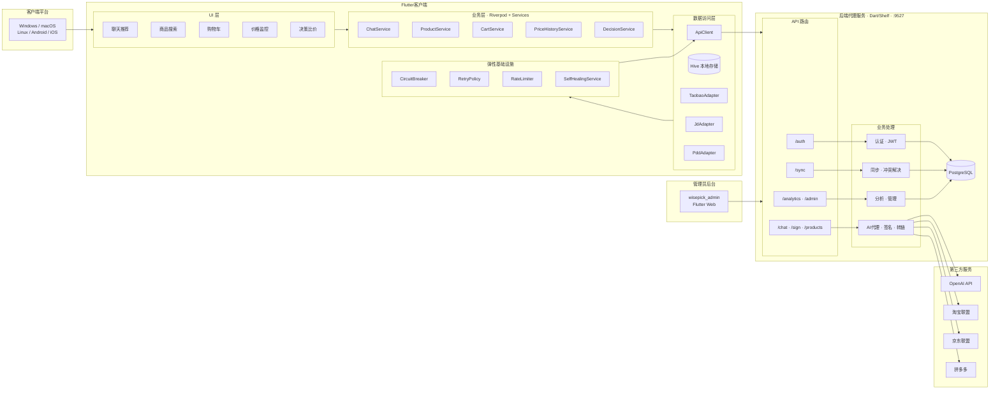

# 图1：系统整体架构图

```mermaid
graph LR
    %% 用户设备
    subgraph 客户端平台
        DEV["Windows / macOS\nLinux / Android / iOS"]
    end

    %% Flutter 客户端
    subgraph Flutter客户端
        subgraph UI["UI 层"]
            U1[聊天推荐]
            U2[商品搜索]
            U3[购物车]
            U4[价格监控]
            U5[决策比价]
        end

        subgraph BIZ["业务层 · Riverpod + Services"]
            B1[ChatService]
            B2[ProductService]
            B3[CartService]
            B4[PriceHistoryService]
            B5[DecisionService]
        end

        subgraph INFRA["弹性基础设施"]
            I1[CircuitBreaker]
            I2[RetryPolicy]
            I3[RateLimiter]
            I4[SelfHealingService]
        end

        subgraph DATA["数据访问层"]
            D1[ApiClient]
            D2[(Hive 本地存储)]
            D3[TaobaoAdapter]
            D4[JdAdapter]
            D5[PddAdapter]
        end
    end

    %% 管理后台
    subgraph 管理员后台
        ADM["wisepick_admin\nFlutter Web"]
    end

    %% 后端
    subgraph 后端代理服务["后端代理服务  ·  Dart/Shelf  ·  :9527"]
        subgraph API["API 路由"]
            A1["/auth"]
            A2["/sync"]
            A3["/analytics · /admin"]
            A4["/chat · /sign · /products"]
        end

        subgraph SVC["业务处理"]
            S1[认证 · JWT]
            S2[同步 · 冲突解决]
            S3[分析 · 管理]
            S4[AI代理 · 签名 · 转链]
        end

        PG[(PostgreSQL)]
    end

    %% 第三方
    subgraph 第三方服务
        EXT1[OpenAI API]
        EXT2[淘宝联盟]
        EXT3[京东联盟]
        EXT4[拼多多]
    end

    %% 连接关系
    DEV --> UI
    UI --> BIZ
    BIZ --> DATA
    DATA --> INFRA
    INFRA --> D1
    D1 --> API

    ADM --> API

    A1 --> S1 --> PG
    A2 --> S2 --> PG
    A3 --> S3 --> PG
    A4 --> S4

    S4 --> EXT1
    S4 --> EXT2
    S4 --> EXT3
    S4 --> EXT4
```
