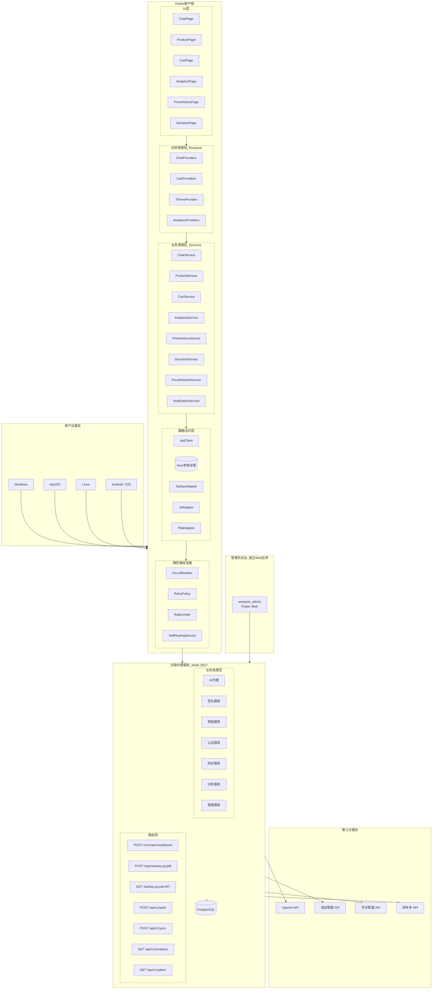

# 图1：系统整体架构图

```mermaid
graph TB
    subgraph 用户设备层
        W[Windows]
        M[macOS]
        L[Linux]
        A[Android / iOS]
    end

    subgraph Flutter客户端
        subgraph UI层
            CP[ChatPage]
            PP[ProductPage]
            CAP[CartPage]
            AP[AnalyticsPage]
            PHP[PriceHistoryPage]
            DP[DecisionPage]
        end

        subgraph 状态管理层_Riverpod
            CPR[ChatProviders]
            CAPR[CartProviders]
            TPR[ThemeProvider]
            APR[AnalyticsProviders]
        end

        subgraph 业务逻辑层_Services
            CS[ChatService]
            PS[ProductService]
            CAS[CartService]
            AS[AnalyticsService]
            PHS[PriceHistoryService]
            DS[DecisionService]
            PRS[PriceRefreshService]
            NS[NotificationService]
        end

        subgraph 数据访问层
            AC[ApiClient]
            HIVE[(Hive本地存储)]
            TA[TaobaoAdapter]
            JA[JdAdapter]
            PA[PddAdapter]
        end

        subgraph 弹性基础设施
            CB[CircuitBreaker]
            RP[RetryPolicy]
            RL[RateLimiter]
            SH[SelfHealingService]
        end
    end

    subgraph 后端代理服务_Shelf_9527
        subgraph 路由层
            R1["POST /v1/chat/completions"]
            R2["POST /sign/taobao,jd,pdd"]
            R3["GET /taobao,jd,pdd API"]
            R4["POST /api/v1/auth"]
            R5["POST /api/v1/sync"]
            R6["GET /api/v1/analytics"]
            R7["GET /api/v1/admin"]
        end

        subgraph 业务处理层
            AIP[AI代理]
            SS[签名服务]
            LS[转链服务]
            AUTH[认证服务]
            SYNC[同步服务]
            ANALY[分析服务]
            ADMIN[管理服务]
        end

        PG[(PostgreSQL)]
    end

    subgraph 管理员后台_独立Web应用
        ADMWEB[wisepick_admin\nFlutter Web]
    end

    subgraph 第三方服务
        OAI[OpenAI API]
        TB[淘宝联盟 API]
        JD[京东联盟 API]
        PDD[拼多多 API]
    end

    W & M & L & A --> Flutter客户端
    UI层 --> 状态管理层_Riverpod
    状态管理层_Riverpod --> 业务逻辑层_Services
    业务逻辑层_Services --> 数据访问层
    数据访问层 --> 弹性基础设施
    弹性基础设施 --> 后端代理服务_Shelf_9527

    后端代理服务_Shelf_9527 --> OAI
    后端代理服务_Shelf_9527 --> TB
    后端代理服务_Shelf_9527 --> JD
    后端代理服务_Shelf_9527 --> PDD
    后端代理服务_Shelf_9527 --> PG

    ADMWEB --> 后端代理服务_Shelf_9527
```
