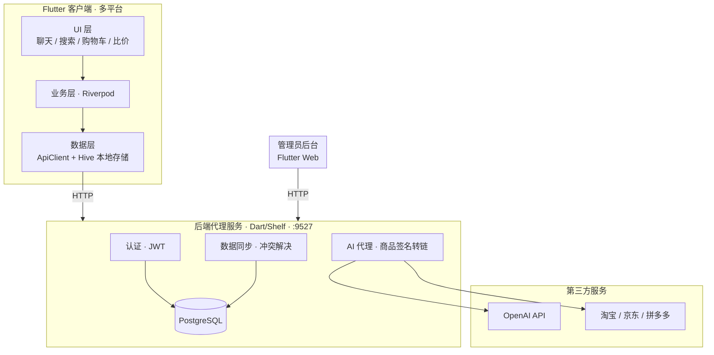

# 图1：系统整体架构图

```mermaid
graph TB
    subgraph CLIENT["Flutter 客户端  ·  多平台"]
        UI["UI 层\n聊天 / 搜索 / 购物车 / 比价"]
        BIZ["业务层  ·  Riverpod"]
        DATA["数据层\nApiClient + Hive 本地存储"]
        UI --> BIZ --> DATA
    end

    subgraph ADMIN["管理员后台\nFlutter Web"]
    end

    subgraph SERVER["后端代理服务  ·  Dart/Shelf  ·  :9527"]
        AUTH["认证  ·  JWT"]
        SYNC["数据同步  ·  冲突解决"]
        PROXY["AI 代理  ·  商品签名转链"]
        PG[(PostgreSQL)]
        AUTH & SYNC --> PG
    end

    subgraph EXT["第三方服务"]
        AI["OpenAI API"]
        SHOP["淘宝 / 京东 / 拼多多"]
    end

    DATA -->|HTTP| SERVER
    ADMIN -->|HTTP| SERVER
    PROXY --> AI & SHOP
```
