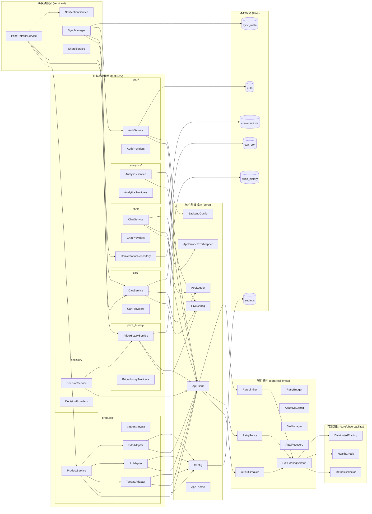

# 图2：功能模块依赖图

```mermaid
graph LR
    subgraph core["核心基础设施 (core/)"]
        AC[ApiClient]
        CFG[Config]
        BC[BackendConfig]
        HC[HiveConfig]
        LOG[AppLogger]
        ERR[AppError / ErrorMapper]
        THM[AppTheme]
    end

    subgraph resilience["弹性组件 (core/resilience/)"]
        CB[CircuitBreaker]
        RP[RetryPolicy]
        RL[RateLimiter]
        RB[RetryBudget]
        AC2[AdaptiveConfig]
        SLO[SloManager]
        AR[AutoRecovery]
        SH[SelfHealingService]
    end

    subgraph observability["可观测性 (core/observability/)"]
        MC[MetricsCollector]
        HCK[HealthCheck]
        DT[DistributedTracing]
    end

    subgraph features["业务功能模块 (features/)"]
        subgraph chat["chat/"]
            CHATSVC[ChatService]
            CHATPVD[ChatProviders]
            CONVREPO[ConversationRepository]
        end

        subgraph products["products/"]
            PRODSVC[ProductService]
            SRCHSVC[SearchService]
            TBADP[TaobaoAdapter]
            JDADP[JdAdapter]
            PDDADP[PddAdapter]
        end

        subgraph cart["cart/"]
            CARTSVC[CartService]
            CARTPVD[CartProviders]
        end

        subgraph analytics["analytics/"]
            ANLSVC[AnalyticsService]
            ANLPVD[AnalyticsProviders]
        end

        subgraph price_history["price_history/"]
            PHSVC[PriceHistoryService]
            PHPVD[PriceHistoryProviders]
        end

        subgraph decision["decision/"]
            DECSVC[DecisionService]
            DECPVD[DecisionProviders]
        end

        subgraph auth["auth/"]
            AUTHSVC[AuthService]
            AUTHPVD[AuthProviders]
        end
    end

    subgraph services["跨模块服务 (services/)"]
        PRS[PriceRefreshService]
        NS[NotificationService]
        SYNC[SyncManager]
        SHARE[ShareService]
    end

    subgraph storage["本地存储 (Hive)"]
        S1[(settings)]
        S2[(cart_box)]
        S3[(conversations)]
        S4[(auth)]
        S5[(price_history)]
        S6[(sync_meta)]
    end

    %% core 依赖
    AC --> CB & RP & RL
    CB & RP & RL --> SH
    SH --> MC & HCK & DT

    %% features 依赖 core
    CHATSVC --> AC & LOG & ERR
    PRODSVC --> AC & CFG
    CARTSVC --> HC & LOG
    ANLSVC --> AC & HC
    PHSVC --> HC & AC
    DECSVC --> AC & PHSVC
    AUTHSVC --> AC & BC

    %% adapter 依赖
    TBADP & JDADP & PDDADP --> AC & CFG
    PRODSVC --> TBADP & JDADP & PDDADP

    %% services 依赖 features
    PRS --> PRODSVC & CARTSVC & PHSVC
    PRS --> NS
    SYNC --> CARTSVC & CONVREPO & AUTHSVC

    %% storage 依赖
    CARTSVC --> S2
    CONVREPO --> S3
    AUTHSVC --> S4
    PHSVC --> S5
    SYNC --> S6
    CFG --> S1
```
