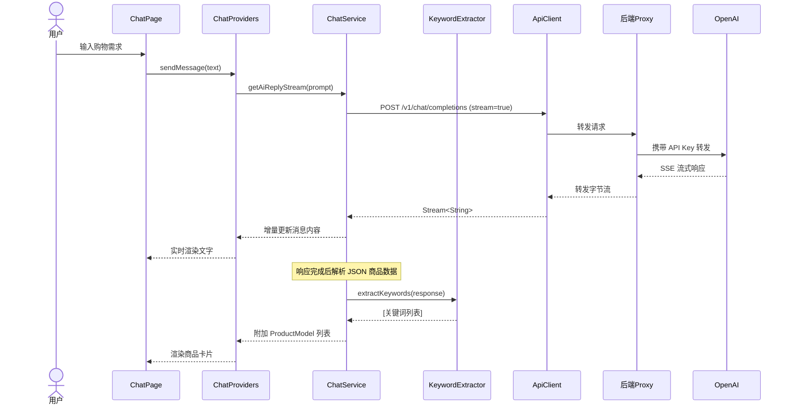
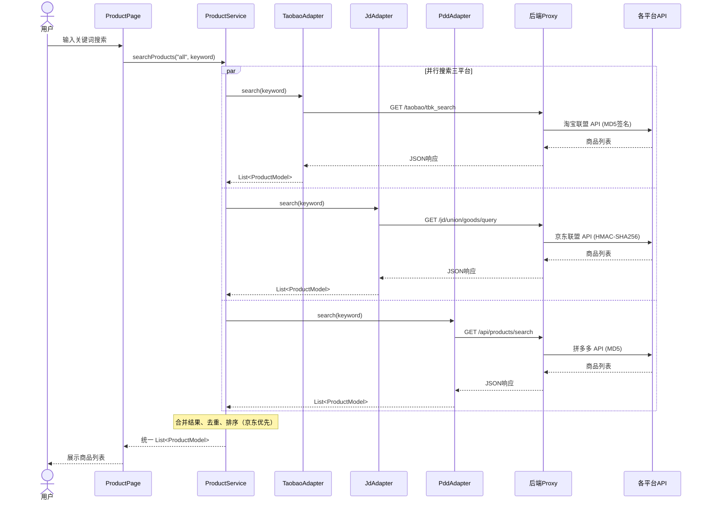
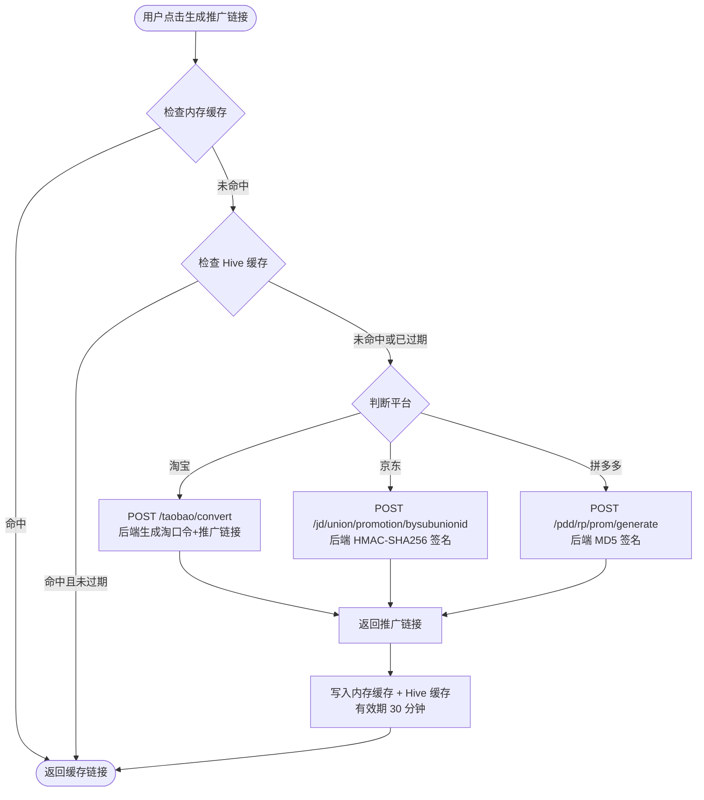
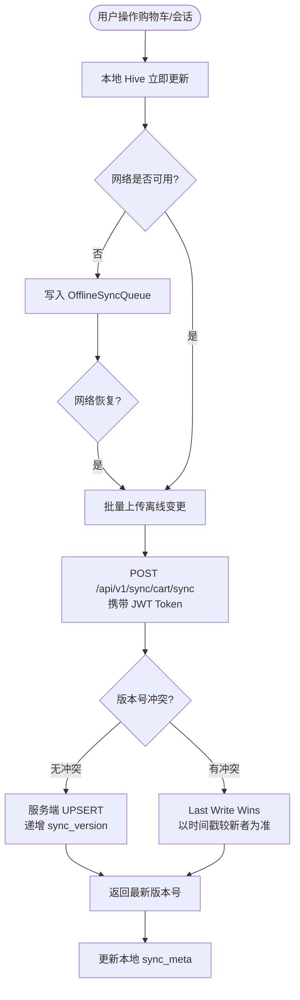

# 图3：核心数据流图

## 3a：AI 聊天推荐完整链路

```mermaid
sequenceDiagram
    actor 用户
    participant ChatPage
    participant ChatProviders
    participant ChatService
    participant KeywordExtractor
    participant ApiClient
    participant 后端Proxy
    participant OpenAI

    用户->>ChatPage: 输入购物需求
    ChatPage->>ChatProviders: sendMessage(text)
    ChatProviders->>ChatService: getAiReplyStream(prompt)
    ChatService->>ApiClient: POST /v1/chat/completions (stream=true)
    ApiClient->>后端Proxy: 转发请求
    后端Proxy->>OpenAI: 携带 API Key 转发
    OpenAI-->>后端Proxy: SSE 流式响应
    后端Proxy-->>ApiClient: 转发字节流
    ApiClient-->>ChatService: Stream<String>
    ChatService-->>ChatProviders: 增量更新消息内容
    ChatProviders-->>ChatPage: 实时渲染文字

    Note over ChatService: 响应完成后解析 JSON 商品数据
    ChatService->>KeywordExtractor: extractKeywords(response)
    KeywordExtractor-->>ChatService: [关键词列表]
    ChatService-->>ChatProviders: 附加 ProductModel 列表
    ChatProviders-->>ChatPage: 渲染商品卡片
```

## 3b：商品搜索完整链路

```mermaid
sequenceDiagram
    actor 用户
    participant ProductPage
    participant ProductService
    participant TaobaoAdapter
    participant JdAdapter
    participant PddAdapter
    participant 后端Proxy
    participant 各平台API

    用户->>ProductPage: 输入关键词搜索
    ProductPage->>ProductService: searchProducts("all", keyword)

    par 并行搜索三平台
        ProductService->>TaobaoAdapter: search(keyword)
        TaobaoAdapter->>后端Proxy: GET /taobao/tbk_search
        后端Proxy->>各平台API: 淘宝联盟 API (MD5签名)
        各平台API-->>后端Proxy: 商品列表
        后端Proxy-->>TaobaoAdapter: JSON响应
        TaobaoAdapter-->>ProductService: List<ProductModel>
    and
        ProductService->>JdAdapter: search(keyword)
        JdAdapter->>后端Proxy: GET /jd/union/goods/query
        后端Proxy->>各平台API: 京东联盟 API (HMAC-SHA256)
        各平台API-->>后端Proxy: 商品列表
        后端Proxy-->>JdAdapter: JSON响应
        JdAdapter-->>ProductService: List<ProductModel>
    and
        ProductService->>PddAdapter: search(keyword)
        PddAdapter->>后端Proxy: GET /api/products/search
        后端Proxy->>各平台API: 拼多多 API (MD5)
        各平台API-->>后端Proxy: 商品列表
        后端Proxy-->>PddAdapter: JSON响应
        PddAdapter-->>ProductService: List<ProductModel>
    end

    Note over ProductService: 合并结果、去重、排序（京东优先）
    ProductService-->>ProductPage: 统一 List<ProductModel>
    ProductPage-->>用户: 展示商品列表
```

## 3c：推广链接生成链路

```mermaid
flowchart TD
    A([用户点击生成推广链接]) --> B{检查内存缓存}
    B -- 命中 --> Z([返回缓存链接])
    B -- 未命中 --> C{检查 Hive 缓存}
    C -- 命中且未过期 --> Z
    C -- 未命中或已过期 --> D{判断平台}

    D -- 淘宝 --> E[POST /taobao/convert\n后端生成淘口令+推广链接]
    D -- 京东 --> F[POST /jd/union/promotion/bysubunionid\n后端 HMAC-SHA256 签名]
    D -- 拼多多 --> G[POST /pdd/rp/prom/generate\n后端 MD5 签名]

    E & F & G --> H[返回推广链接]
    H --> I[写入内存缓存 + Hive 缓存\n有效期 30 分钟]
    I --> Z
```

## 3d：数据同步链路

```mermaid
flowchart TD
    A([用户操作购物车/会话]) --> B[本地 Hive 立即更新]
    B --> C{网络是否可用?}
    C -- 否 --> D[写入 OfflineSyncQueue]
    D --> E{网络恢复?}
    E -- 是 --> F[批量上传离线变更]
    C -- 是 --> F
    F --> G[POST /api/v1/sync/cart/sync\n携带 JWT Token]
    G --> H{版本号冲突?}
    H -- 无冲突 --> I[服务端 UPSERT\n递增 sync_version]
    H -- 有冲突 --> J[Last Write Wins\n以时间戳较新者为准]
    I & J --> K[返回最新版本号]
    K --> L[更新本地 sync_meta]
```
