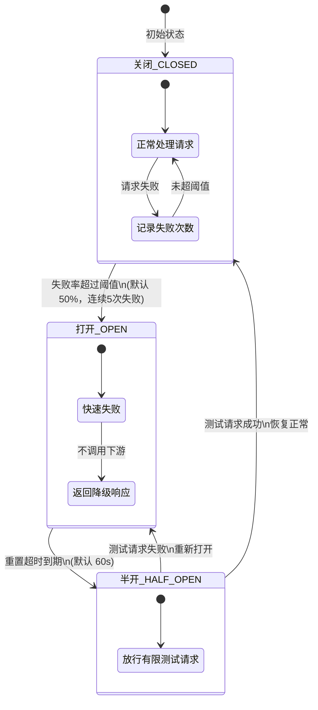
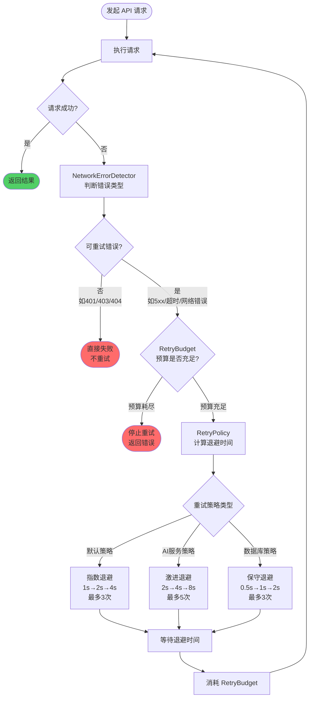
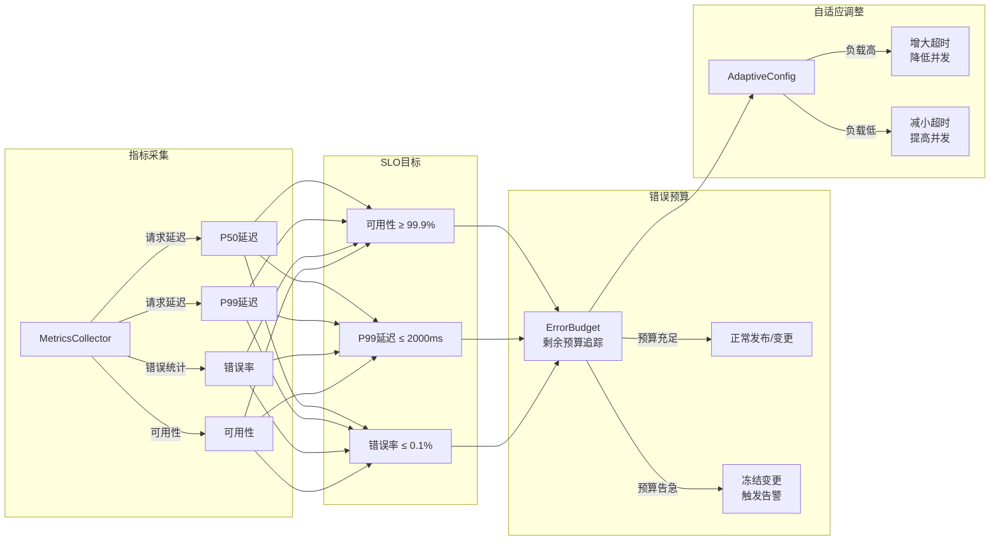
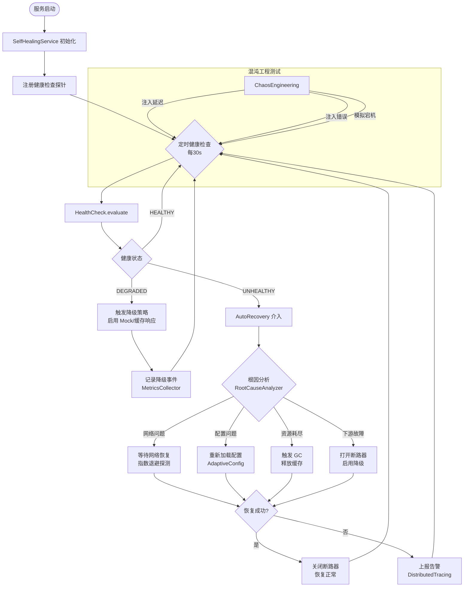

# 图4：弹性基础设施工作流图

## 4a：断路器状态机

```mermaid
stateDiagram-v2
    [*] --> 关闭_CLOSED : 初始状态

    关闭_CLOSED --> 打开_OPEN : 失败率超过阈值\n(默认 50%，连续5次失败)
    打开_OPEN --> 半开_HALF_OPEN : 重置超时到期\n(默认 60s)
    半开_HALF_OPEN --> 关闭_CLOSED : 测试请求成功\n恢复正常
    半开_HALF_OPEN --> 打开_OPEN : 测试请求失败\n重新打开

    state 关闭_CLOSED {
        [*] --> 正常处理请求
        正常处理请求 --> 记录失败次数 : 请求失败
        记录失败次数 --> 正常处理请求 : 未超阈值
    }

    state 打开_OPEN {
        [*] --> 快速失败
        快速失败 --> 返回降级响应 : 不调用下游
    }

    state 半开_HALF_OPEN {
        [*] --> 放行有限测试请求
    }
```

## 4b：重试策略与预算控制

```mermaid
flowchart TD
    A([发起 API 请求]) --> B[执行请求]
    B --> C{请求成功?}
    C -- 是 --> Z([返回结果])
    C -- 否 --> D[NetworkErrorDetector\n判断错误类型]

    D --> E{可重试错误?}
    E -- 否\n如401/403/404 --> FAIL([直接失败\n不重试])

    E -- 是\n如5xx/超时/网络错误 --> F{RetryBudget\n预算是否充足?}
    F -- 预算耗尽 --> FAIL2([停止重试\n返回错误])

    F -- 预算充足 --> G[RetryPolicy\n计算退避时间]
    G --> H{重试策略类型}

    H -- 默认策略 --> I[指数退避\n1s→2s→4s\n最多3次]
    H -- AI服务策略 --> J[激进退避\n2s→4s→8s\n最多5次]
    H -- 数据库策略 --> K[保守退避\n0.5s→1s→2s\n最多3次]

    I & J & K --> L[等待退避时间]
    L --> M[消耗 RetryBudget]
    M --> B

    style FAIL fill:#ff6b6b
    style FAIL2 fill:#ff6b6b
    style Z fill:#51cf66
```

## 4c：自适应配置与 SLO 管理

```mermaid
flowchart LR
    subgraph 指标采集
        MC[MetricsCollector]
        MC --> |请求延迟| P50[P50延迟]
        MC --> |请求延迟| P99[P99延迟]
        MC --> |错误统计| ER[错误率]
        MC --> |可用性| AV[可用性]
    end

    subgraph SLO目标
        SLO1[可用性 ≥ 99.9%]
        SLO2[P99延迟 ≤ 2000ms]
        SLO3[错误率 ≤ 0.1%]
    end

    subgraph 错误预算
        EB[ErrorBudget\n剩余预算追踪]
        EB --> |预算充足| NORMAL[正常发布/变更]
        EB --> |预算告急| FREEZE[冻结变更\n触发告警]
    end

    subgraph 自适应调整
        AC[AdaptiveConfig]
        AC --> |负载高| INC[增大超时\n降低并发]
        AC --> |负载低| DEC[减小超时\n提高并发]
    end

    P50 & P99 & ER & AV --> SLO1 & SLO2 & SLO3
    SLO1 & SLO2 & SLO3 --> EB
    EB --> AC
```

## 4d：自愈服务完整流程

```mermaid
flowchart TD
    A([服务启动]) --> B[SelfHealingService 初始化]
    B --> C[注册健康检查探针]
    C --> D{定时健康检查\n每30s}

    D --> E[HealthCheck.evaluate]
    E --> F{健康状态}

    F -- HEALTHY --> D
    F -- DEGRADED --> G[触发降级策略\n启用 Mock/缓存响应]
    F -- UNHEALTHY --> H[AutoRecovery 介入]

    G --> I[记录降级事件\nMetricsCollector]
    I --> D

    H --> J{根因分析\nRootCauseAnalyzer}
    J -- 网络问题 --> K[等待网络恢复\n指数退避探测]
    J -- 配置问题 --> L[重新加载配置\nAdaptiveConfig]
    J -- 资源耗尽 --> M[触发 GC\n释放缓存]
    J -- 下游故障 --> N[打开断路器\n启用降级]

    K & L & M & N --> O{恢复成功?}
    O -- 是 --> P[关闭断路器\n恢复正常]
    O -- 否 --> Q[上报告警\nDistributedTracing]
    P --> D
    Q --> D

    subgraph 混沌工程测试
        CE[ChaosEngineering]
        CE --> |注入延迟| D
        CE --> |注入错误| D
        CE --> |模拟宕机| D
    end
```
