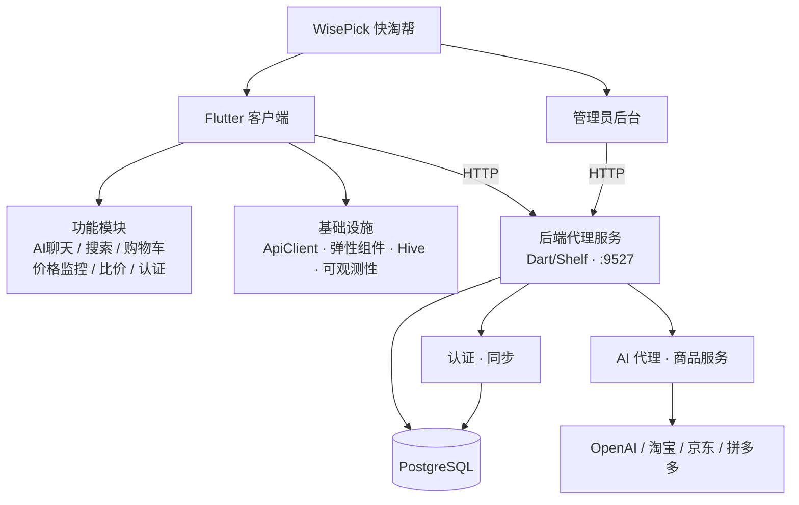

# 图5：系统功能结构图

```mermaid
graph TD
    ROOT["WisePick 快淘帮"]

    ROOT --> CLIENT["Flutter 客户端"]
    ROOT --> ADMIN["管理员后台"]

    CLIENT --> FEAT["功能模块\nAI聊天 / 搜索 / 购物车\n价格监控 / 比价 / 认证"]
    CLIENT --> CORE["基础设施\nApiClient · 弹性组件 · Hive · 可观测性"]

    CLIENT -->|HTTP| SERVER["后端代理服务\nDart/Shelf · :9527"]
    ADMIN  -->|HTTP| SERVER

    SERVER --> B1["认证 · 同步"]
    SERVER --> B2["AI 代理 · 商品服务"]
    SERVER --> DB[("PostgreSQL")]

    B1 --> DB
    B2 --> EXT["OpenAI / 淘宝 / 京东 / 拼多多"]
```
