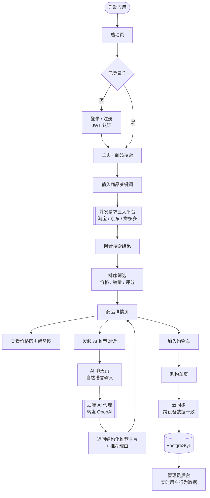

# 图6：核心用户流程图

```mermaid
flowchart TD
    A(["启动应用"]) --> B["启动页"]
    B --> C{"已登录？"}
    C -->|否| D["登录 / 注册\nJWT 认证"]
    D --> E["主页 · 商品搜索"]
    C -->|是| E

    E --> F["输入商品关键词"]
    F --> G[["并发请求三大平台\n淘宝 / 京东 / 拼多多"]]
    G --> H["聚合搜索结果"]
    H --> I["排序筛选\n价格 / 销量 / 评分"]

    I --> J["商品详情页"]
    J --> K["查看价格历史趋势图"]
    J --> L["加入购物车"]
    J --> M["发起 AI 推荐对话"]

    M --> N["AI 聊天页\n自然语言输入"]
    N --> O[["后端 AI 代理\n转发 OpenAI"]]
    O --> P["返回结构化推荐卡片\n+ 推荐理由"]
    P --> J

    L --> Q["购物车页"]
    Q --> R[["云同步\n跨设备数据一致"]]
    R --> S[("PostgreSQL")]

    S --> T["管理员后台\n实时用户行为数据"]
```
